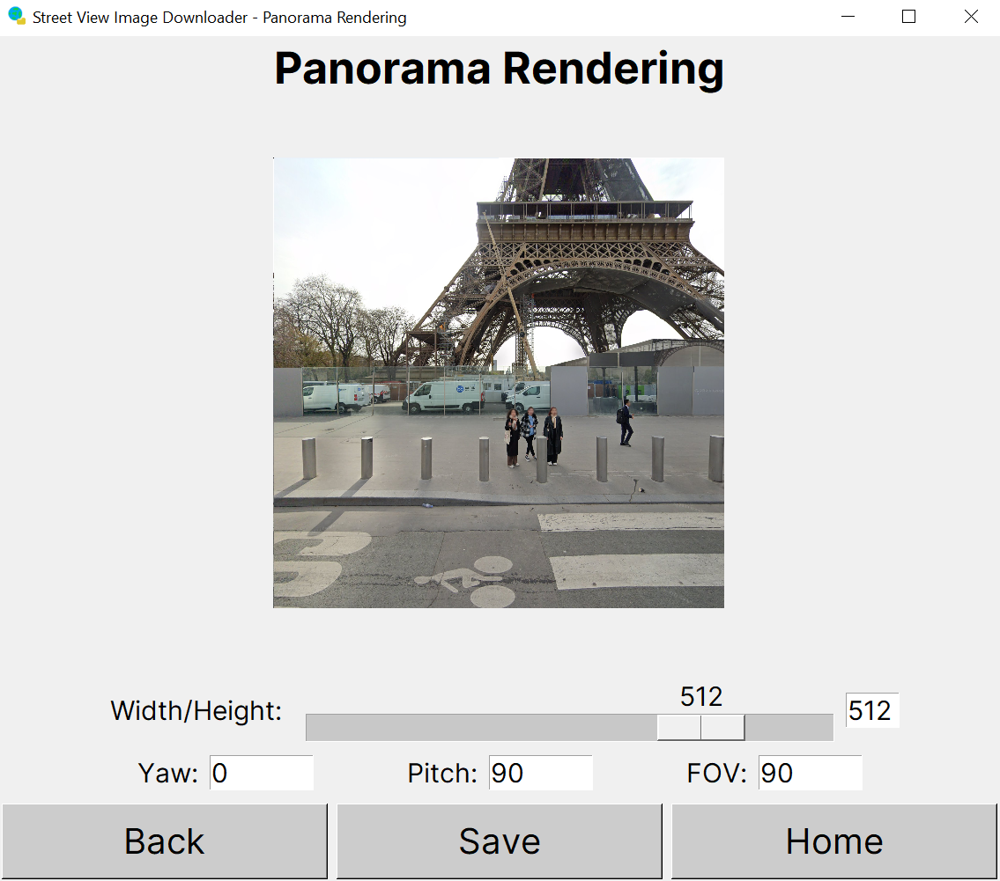
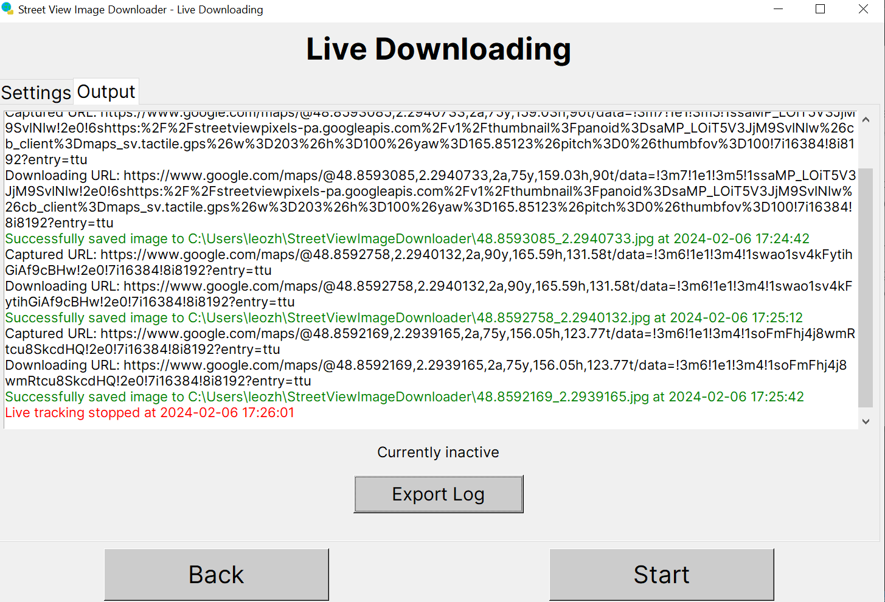

# Street View Image Downloader - App

The Street View Image Downloader app is a convenient deskop application that provides the library functionality alongside additional features.

These are the features in the app summarised:
- **Download by Panorama ID** - a panorama ID is input, the zoom level is set, and the panorama tile range to download can also be set.
- **Download by URL** - a Google Street View URL is input and the output width and height is set.
- **Batch Download** - download multiple panoramas or URLs by setting the panorama ID, file save path or URL, file save path pairs.
- **Panorama Rendering** - project a panorama onto a square image and allow mouse movement to adjust the yaw, pitch and FOV, updating the display accordingly.
- **Live Downloading** - opening a tracked Chrome window and capturing Street View URLs to download either panoramas or URL views, with many settings to control the flow.

## Requirements

The app can be run in two ways, as an executable or through Python, with the former being much simpler to set up.

Note, the app is only supported for **Windows**.

### Running through EXE
A pre-built standalone Windows EXE is available in a Release, which can be downloaded and run directly.

Upon running the EXE, if successful, the app will launch on the main menu.

### Running through Python
Alternatively, for more advanced users, or those who have security policies barring running external EXEs, it is also possible to run the program through Python.

Follow these steps to set up and run the code:
1. Download the source code from a Release.
2. Ensure Python version **3.10** or above is installed and in use.
3. Ensure the following third party libraries are installed.
    - [aiohttp](https://pypi.org/project/aiohttp/)
    - [requests](https://pypi.org/project/requests/)
    - [pillow](https://pypi.org/project/pillow/)
    - [psutil](https://pypi.org/project/psutil/)
    - [pyglet](https://pypi.org/project/pyglet/)
To install these libraries, use pip, something like this: `pip install aiohttp requests pillow psutil pyglet`
4. Some C++ code is also used in this project for performance and API reasons. If you plan to modify and re-compile the C++ code yourself, note that `conversion.so` is a shared library formed by compiling `cubemap.cpp` and `projection.cpp` and `foreground.so` is a shared library by compiling `foreground.cpp`. For example, for `conversion.so`, the following g++ command has been used with `src/gui/cpp` as the current working directory: `g++ cubemap.cpp projection.cpp --static --shared -o conversion.so -O2`.
5. Run the `run_app.py` toplevel script. If successful, the app will launch on the main menu. Alternatively, running `main.py` in the GUI code folder also works.

## Tutorial Disclaimer
Whilst this tutorial covers the majority of key functionality, small features may have been omitted. Feel free to experiment with the app as required to understand the more subtle features, and advanced users can also read the source code for better understanding of complex app logic.

## Download by Panorama ID
The first feature of the app is simply downloading panoramas by ID, which is the GUI equivalent of the internal code. Upon entering the section, you will be shown a screen like so:

Here are the involved inputs:
- **Panorama ID** - every official Google Street View panorama has a corresponding **22** character long panorama ID to uniquely identify each one. Note that there are also unofficial 3rd party panoramas on Street View that are not supported by this app, so these cannot be input. Anyways, here is an example: https://www.google.co.uk/maps/@48.8591378,2.2936763,3a,75y,146.2h,124.63t/data=!3m6!1e1!3m4!1s1KNVulesHVWQedZwVM1v8w!2e0!7i16384!8i8192?entry=ttu. Identify the **'!1s'** string evident, and the following 22 characters represent the panorama ID, hence: **1KNVulesHVWQedZwVM1v8w** in this example.
- **Zoom** - Google Street View panoramas can be downloaded in 6 zoom levels, from 0 to 5, with greater zoom levels yielding better quality but exponentially larger images. Most panoramas support all zooms and virtually all panoramas support zooms 0 to 4. Select the appropriate zoom you would like to download at.
Panoramas are split into **512x512 tiles**. For your convenience, here are tile and maximum image dimensions for each zoom level:
    - 0 - single tile (512x512)
    - 1 - 2x1 tiles (1024x512)
    - 2 - 4x2 tiles (2048x1024)
    - 3 - 8x4 tiles (4096x2048)
    - 4 - 16x8 tiles (8192x4096)
    - 5 - 32x16 tiles (16384x8192)
- **Panorama Area** - it is further possible to only download a portion of a panorama. Select the zoom and drag the two circles as required to form the area of the panorama to download.

Here is an example of downloading an entire panorama in zoom 4:

Once you have provided the inputs, proceed to download the panorama and a top level popup appears displaying the progress, something like so;

By cancelling, all processing stops and the top level closes. Note, if an error occurs due to network issues or no panorama with the given ID found, it will be shown and the download terminated.

Otherwise, upon success, you will see this screen:

- The panorama is displayed. Scrollbars are provided as required if the panorama is too large to show entirely, which is the case for even moderate zooms.
- To save the panorama to a file, press 'Save' or use Ctrl+S. A file dialog will appear, prompting you for the file save path.
- This screen is linked to the panorama rendering feature. Press 'Render' to be brought directly to the panorama rendering screen. Note, this option will not always be available depending on panorama settings. For more information, see the Panorama Rendering section.
- The 'Download Another' button sends you back to the panorama inputs so you can go ahead and download another panorama as you wish.

## Download by URL
The app also supports downloading a view seen at a given Google Street View URL on the web app, by considering camera angles and zoom. By entering the corresponding section, you will see the following:

Here are the involved inputs:
- **URL** - this is the Google Street View URL you wish to download. Based on this URL, various information can be deduced. Taking the example: https://www.google.co.uk/maps/@48.8591378,2.2936763,3a,75y,146.2h,124.63t/data=!3m6!1e1!3m4!1s1KNVulesHVWQedZwVM1v8w!2e0!7i16384!8i8192?entry=ttu
    - **Latitude** (degrees north or south of equator) = 48.8591378
    - **Longitude** (degrees east or west or prime meridian) = 2.2936763
    - **Yaw** (bearing in degrees relative to North) = 146.2
    - **Pitch** (vertical rotation, with 90 degrees as horizontal) = 124.63
    - **FOV** (field of view in degrees / zoom) = 75
    - **Panorama ID** = 1KNVulesHVWQedZwVM1v8w

    For the URL downloading, only yaw, pitch, FOV and panorama ID are relevant, the rest is for your understanding of the main data stored in Google Street View URLs.

    Ensure you input any Street View URLs carefully since the validation is somewhat strict.
- **Width** - width of the output image, between 32 and 2048 pixels.
- **Height** - height of the output image, between 16 and 2048 pixels.

Further note whilst the secret API is somewhat powerful, its resolution has been slightly **limited**, so an image may be scaled up by the program as required if the returned image is smaller than the expected width and height.

Here is an example of filled in inputs, with the output image having dimensions of 1024x768:

After downloading, expect a screen like so:

- Again, the image preview is shown with scrollbars available if needed.
- The image can be saved to disk as usual using the 'Save' button or Ctrl+S.
- Again, you can go back and download another URL through the 'Download Another' button.
- There is no concept of URL rendering in the program, since in fact, the URL downloading simply feeds the angles to the Google API, which renders the panorama with the given angles and returns the rendered image as the response. 

## Batch Download
Batch processing is simple yet effective - processing inputs in bulk so that automation time is longer without any human intervention required. This app supports batch processing through the batch downloader, which when opened, shows this:

There is quite a lot going on here, so to break it down, here are the key points to note:
- It is possible to download both **panoramas and URL views** in bulk. Select the appropriate mode as seen in the Download By option.
- The table consists of **value, file path pairs**, where the first column is for panorama ID or URL, and the second is for the file save path.
- To add a panorama ID or URL, press the 'Add' button and a top level opens, prompting you for either a panorama ID or URL depending on the current download mode, alongside a file save path.
For example, to add a panorama to download, here is a possible set of inputs:

After adding, this is the resulting screen:

The table is limited in size so scrollbars are displayed as required.
- To alter download settings, press the 'Settings' button and relevant settings are shown: zoom and download area for panoramas and dimensions for URLs. Simply configure these settings and save the settings. These settings will apply to all panoramas/URLs.
For example, after applying zoom 3 for all panoramas being downloaded, this is the resulting screen (note the change in the info label just above the buttons):

- It is also possible to edit/delete existing inputs. Simply click into the appropriate row to edit or delete and the following window appears:
    

    Make any changes to the inputs and press 'Edit', or press 'Delete' to delete the row entirely.
- It is possible to export the inputs to a **CSV** file for convenience. This will result in two relevant heading names as seen in the table followed by the rows of inputs.
- Likewise, it is also possible to import inputs for both panorama IDs and URLs from a CSV file. The first column is expected to be panorama IDs or URLs, and the second is expected to be the file save paths. Only the first two columns are considered, and all inputs must be valid. The first row is ignored to account for **headings**, otherwise is included if valid, and the rest of the rows must be valid or else the import will fail. The import will overwrite any existing rows in the input table upon confirmaton.
- The **Stop Upon Error** option can be selected to terminate batch downloading upon any error, whether it is network related, IO related, due to a missing panorama, or any other reason, otherwise errors are just logged and the download continues if possible.

After adding some more panorama IDs, the final screen before downloading is as follows:

Note, despite this example focusing on panorama ID only, this information can be transferred to URL input, with usual URL validation and settings included.

Now, upon successful downloading, the following screen is expected:

- The download progress has been displayed and upon success, has reached 100%.
- Relevant logging has been included.
- During the download, cancelling the download will stop the processing and close the top level. By closing the top level window, downloading will also automatically be cancelled.

## Panorama Rendering
Another feature of the app is built-in rendering, allowing panoramas to be rendered onto a square projection with the ability to control the camera view. Upon entering the panorama rendering section, this is shown:

- There are two methods of inputting the panorama, either by providing the **panorama ID** directly or providing a valid **Street View URL** and allowing the program to extract the panorama ID from it. Select the one you are more comfortable using.
- The panorama zoom must be set to either 4 or 5. In summary, zoom 4 rendering is faster and less memory intensive than zoom 5, but zoom 5 has the better quality than zoom 4. Ensure you make the appropriate choice based on your requirements.

Here is a sample complete input, inputting a panorama ID directly and using zoom 4:

Upon starting, firstly, the panorama tiles must be downloaded, and then the cubemap for rendering purposes must be generated, taking a few seconds. Once done, the projection screen is then available:

- The **projected image** is clearly shown. Use your **mouse** to drag around to move, and scroll to zoom in and out just like on Google Street View. After some movement, this is the result:

- You can set the square length (width/height) of the projected image between 64 and 625 pixels.
- For advanced users, there is the option to manually adjust the yaw, pitch and FOV angles too, simply by modifying the corresponding inputs. All angles are in degrees.
    - Yaw range: [0, 360)
    - Pitch range: [1, 179] (90 is horizontal)
    - FOV range: [15, 90]

    Expermiment with these angles if you are unsure about how they work yet would like to control them directly rather than using mouse input, for perfect accuracy.
- It is possible to save the current projected image using the 'Save' button at the bottom.

## Live Downloading
Finally, the live downloading feature is a powerful extension to the project functionality. It provides the opportunity to open a Chrome window and Street View is then used live on that window. Since the URL changes as you move in Street View, this allows the program to capture the URLs and download panoramas or URL views accordingly. Upon launching the live downloader, this screen will be shown:

There are two main sections to the live downloader GUI, the settings and the output log. The settings customise the live downloading, and the output displays information whilst the live Chrome window is running.

Below are explanations of how each setting works:
- **Image Mode** - this is simply whether to download a panorama image or the URL view when a particular Street View URL is captured. If panorama mode is selected, the panorama ID is extracted from the URL and downloaded from there. It is indeed possible to apply download settings as usual (zoom and crop area for panoramas and width/height for URL views). Press the 'Edit' button to modify the settings.
- **Capture Mode** - the URLs need to be captured in some way. Three options are provided:
    - **New Latitude/Longitude** - each position in Google Street View has a unique latitude and longitude pair, so every time a new latitude or longitude is seen in the URL for the current session (since starting the live tracking), the URL is captured for processing.
    - **Fixed Intervals** - the URL is captured at fixed time intervals and processed (ignored if invalid). It is also possible to pause live tracking by selecting this mode and the 'Paused' value. Note, this still ignores URLs with already seen latitudes and longitude for the current live session.
    
    - **Keybind** - you can control URL downloading using a keybind of your choice. Open the keybind editing window, and to set the keybind, simply create the keybind by pressing the keys accordingly. The Ctrl, Shift and Alt keys are supported, and you can chain up to 3 keybinds as part of the input to signal a URL capture. It is recommended you select a suitable keybind not already in use for other functionality. Experiment with this setting if are unsure about how it works. The default keybind is 'q', a simple yet unused key in Google Street View.
    
- **Save Folder** - simply the folder to save the images to.
- **Filename Mode** - it is necessary to specify the way of generating the file name. There are many options provided by the program:
    - **Smallest Available Integer** - the smallest integer starting from 0 that can be used is used for the file name of images as they are saved. Hence 0.jpg is used if possible, then 1.jpg, then 2.jpg etc.
    - **Unix Timestamp** - the time since the epoch in whole seconds is used as the file name e.g. 1707239101.jpg
    - **Formatted Date/Time** - the current date/time is used as the file name e.g. 2024-01-30T21.27.24.jpg
    - **Latitude/Longitude** - the latitude and longitude of the URL are used as the file name e.g. 48.8591378_2.2936763.jpg
    - **Panorama ID** (panorama mode only) - the panorama ID is used as the file name e.g. 1KNVulesHVWQedZwVM1v8w.jpg
- **Download Mode** - sometimes the rate at which the URLs are registered is greater than the rate at which the program can process them. In this case, you have two options, to either build a queue so that all URLs are queued and can accumulate infinitely, or download on demand, meaning maximum one URL can be in the queue at a time and a newly registered URL will overrid any existing URL in the queue (too slow).
- **Stop Upon Error** - errors may occur during live tracking, which can either be ignored, or cause immediate termination of the live tracking. If selected, any error will cause the live window to close abruptly, so that you do not keep on using the live tracker without realising something is going wrong.

Furthermore, it is also possible to export the settings to a **JSON** file which can then be imported again, so that you do not need to keep adjusting the settings each time you open the live downloading screen. See the 'Export JSON' and 'Import JSON' buttons near the bottom. Note that for integrity, modification of the settings in the JSON file is **disallowed** and modified settings cannot be imported. This is particularly useful if you plan to use the live downloading feature regularly using custom settings significantly different from the default settings.

Also, you can modify the settings even whilst a live session is running. This mostly works without any side effects, but note these behaviours:
- Every time the capture mode 'Fixed Intervals' is changed, the timer resets to the interval duration. For example, if you have 12 seconds until the next URL capture but change the interval to 60 seconds, the timer will be reset from 12 to 60 seconds.
- If download mode is set to 'On Demand' whilst a queue longer than 1 is active, the queue reduces to the most recently registered URL only. Be careful, as setting the mode back to 'Queue' right after will not undo this.

Hence, here is a possible complete settings screen:

- 1024x1024 URL views are generated.
- URLs are captured every 30 seconds.
- File names are by latitude/longitude.
- The download mode is on demand.
- The session will end upon an error.

Next, to actually start, press the 'Start' button. After a few seconds, a Chrome window should appear:

Here, the Google Maps URL has been loaded, and this is a standard message from Google since this a fresh browser. Simply accept and proceed.

Then, open Street View onto a place of your choice, and begin moving around as required. The capturing will take place and processing will occur as per the settings. For keybind capturing, each time the keybind is detected on the live Chrome window, the URL is registered.

Stay on the single original Chrome tab, as going beyond this is not supported by the program and will result in unexpected behaviour.

Once you are done, to stop the live tracking, simply press the 'Stop' button or close the Chrome window.

The output log after a successful session may look like this:

You can export this log to plain text using the 'Export Log' button.

The Live Downloading feature is an interesting one, feel free to experiment with it to understand it better if the tutorial is insufficient.
